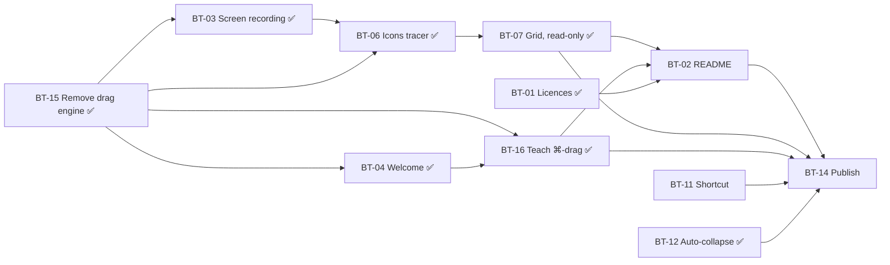

# BarT — Board

Scope and decisions: [PRD.md](PRD.md). One file per issue in [issues/](issues/) — each written to
be handed to a fresh session on its own.

**Revised 2026-09-17.** The Ice code comes out (PRD §7), which deletes automatic arranging and with
it four issues. BarT ships free; the price question waits for the assertion engine.

**Mode markers**
- 🤖 **AFK** — I can build *and* verify it alone (build, self-tests, screenshots, `System Events`).
- 👤 **HITL** — needs you somewhere, and the issue says where. Three things I cannot do: grant a
  permission, judge whether something *feels* right, use your GitHub account.

## Columns

### Ready — unblocked, startable now
| ID | Title | Mode |
| --- | --- | --- |
| [BT-11](issues/BT-11.md) | Configurable shortcut | 👤 HITL |
| [BT-02](issues/BT-02.md) | README for a public audience | 🤖 AFK |

### Blocked
| ID | Title | Mode | Waiting for |
| --- | --- | --- | --- |
| [BT-14](issues/BT-14.md) | Publish 1.0 | 👤 HITL | everything |

### Done
| ID | Title | Verified by |
| --- | --- | --- |
| [BT-12](issues/BT-12.md) | Auto-collapse after 15 seconds | Icon `»` → hotkey → `«` → 16 s → `»`, captured live |
| [BT-01](issues/BT-01.md) | Ship the licences | grep proves no "MIT" claim is left; about-panel text still needs one human look |
| [BT-15](issues/BT-15.md) | Remove the Ice-derived drag engine | ~1,000 lines gone, gates pass, reveal and auto-collapse unchanged on the live bar |
| [BT-03](issues/BT-03.md) | Screen recording: ask at the right moment | Granted and revoked live: banner, General state and the item names follow on activation, no reopening |
| [BT-06](issues/BT-06.md) | Tracer bullet: real icons | Confirmed live: every item in the list carries its own icon, 1.25 s per pass, 0 % CPU while the window sits open |
| [BT-07](issues/BT-07.md) | The section grid, read-only | Three grids on the live bar at the window minimum; twenty-one AXImage elements read back with their names |
| [BT-04](issues/BT-04.md) | Welcome window on first launch | Deleted the defaults domain: the window comes on the next launch, not the one after, and the menu brings it back |
| [BT-16](issues/BT-16.md) | Teach the ⌘-drag | Read back by the maintainer; the first real ⌘-drag landed the item in Hidden, icon and all |

### Dropped
| ID | Title | Why |
| --- | --- | --- |
| [BT-13](issues/BT-13.md) | Accessibility names for the tabs | The problem never existed — `.tabItem` already sets `AXDescription` |
| [BT-05](issues/BT-05.md) | Starting-point proposal | BarT cannot move items any more |
| [BT-08](issues/BT-08.md) | Context menu on icons | The items view is read-only |
| [BT-09](issues/BT-09.md) | Drag icons between sections | Would need the capability BT-15 removes |
| [BT-10](issues/BT-10.md) | Rework "could not be positioned" | The failure disappears with the engine |

## Dependency graph

## How this is cut

Every issue is a **vertical slice**: it crosses whatever layers it needs and ends in something
observable in the running app. Hence the "Visible result" line in each — an issue that cannot state
one is cut wrong.

[BT-15](issues/BT-15.md) is the exception that proves it: its visible result is *nothing changes*.
It deletes machinery the user never saw, and the proof of success is that reveal and collapse
behave exactly as before. That is why it is one removing commit and nothing else — revertible in a
single step if the assertion engine later wants pieces back.

The tracer-bullet idea survives in [BT-06](issues/BT-06.md): capture one icon per item and draw it
in the list that already exists, before building the grid on top of it. It answers the riskiest
unknown (a new permission, an unproven API, unknown cost) first rather than last.

## Parallelism

Two issues are left before publishing: [BT-11](issues/BT-11.md) (the shortcut is still hard-wired,
👤 HITL) and [BT-02](issues/BT-02.md) (the README, 🤖 AFK). They do not touch each other. After
them only [BT-14](issues/BT-14.md) remains, and that one needs a person for every step anyway.

BT-16 corrected the README's worst falsehoods on the way through — simulated ⌘-drags, an
accessibility permission, an assignment in `UserDefaults`, all gone since BT-15. What BT-02 still
owns is the structure and the stranger's path from "downloaded a zip" to "working app".

One question BT-14 has to answer and nobody has: the licence sections still credit Ice for a drag
technique BT-15 deleted. Whether BarT is still a derivative work decides whether it stays GPL-3.0
(PRD §7).
