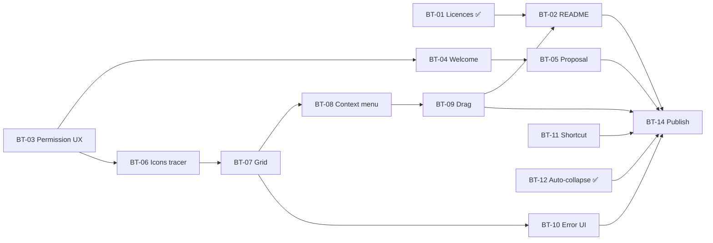

# BarT — Board

Scope and decisions: [PRD.md](PRD.md). One file per issue in [issues/](issues/) — each is written
to be handed to a fresh session on its own.

**Mode markers**
- 🤖 **AFK** — I can build *and* verify it alone (build, self-tests, screenshots, `System Events`
  queries). You read the result when you feel like it.
- 👤 **HITL** — needs you at some point, and the issue says exactly where. Three things I cannot do:
  grant a TCC permission, judge whether something *feels* right, and use your GitHub account.

## Columns

### Ready — unblocked, startable now, in parallel
| ID | Title | Mode |
| --- | --- | --- |
| [BT-03](issues/BT-03.md) | Accessibility permission: honest state, honest UI | 👤 HITL |
| [BT-11](issues/BT-11.md) | Configurable shortcut | 👤 HITL |

### Blocked
| ID | Title | Mode | Waiting for |
| --- | --- | --- | --- |
| [BT-02](issues/BT-02.md) | README for a public audience | 🤖 AFK | BT-01 ✅, **BT-09** |
| [BT-04](issues/BT-04.md) | Welcome window on first launch | 👤 HITL | BT-03 |
| [BT-05](issues/BT-05.md) | Starting-point proposal | 👤 HITL | BT-04 |
| [BT-06](issues/BT-06.md) | Tracer bullet: real icons in the existing list | 👤 HITL | BT-03 |
| [BT-07](issues/BT-07.md) | The section grid replaces the list | 🤖 AFK | BT-06 |
| [BT-08](issues/BT-08.md) | Context menu and accessible icons | 🤖 AFK | BT-07 |
| [BT-09](issues/BT-09.md) | Drag icons between sections | 👤 HITL | BT-08 |
| [BT-10](issues/BT-10.md) | Rework "could not be positioned" | 🤖 AFK | BT-07 |
| [BT-14](issues/BT-14.md) | Publish 1.0 | 👤 HITL | everything |

### In progress
_(empty)_

### Done
| ID | Title | Verified by |
| --- | --- | --- |
| [BT-12](issues/BT-12.md) | Auto-collapse after 15 seconds | Icon `»` → hotkey → `«` → 16 s → `»`, captured from the live menu bar |
| [BT-01](issues/BT-01.md) | Ship the licences | grep proves no "MIT" claim is left; about-panel text still needs one human look |

### Dropped
| ID | Title | Why |
| --- | --- | --- |
| [BT-13](issues/BT-13.md) | Accessibility names for the two tabs | The problem did not exist — `.tabItem` already sets `AXDescription`; measured on the unmodified build |

## Dependency graph

## How this is cut

Every issue is a **vertical slice**: it crosses whatever layers it needs — capture engine,
controller, view — and ends in something observable in the running app. That is why each one
carries a "Visible result" line; if an issue cannot state one, it is cut wrong and should be
merged with its neighbour.

The one place this matters most is the icons. The horizontal version would have been "build the
capture engine", then "build the grid on top of it" — and the riskiest unknown in the plan (a new
permission, an unproven API, unknown cost) would only be answered at the end of the second step.
Instead [BT-06](issues/BT-06.md) is a tracer bullet: capture one icon per item, cache it, and draw
it in the list **that already exists**. The grid ([BT-07](issues/BT-07.md)) then only rearranges
data that is already flowing.

Two ordering rules that are not visible in the graph:

- **BT-07 → BT-08 stay adjacent.** In between, the items view is mouse-only. The keyboard and
  VoiceOver path is a floor, not a follow-up.
- **BT-03 comes first among the HITL issues.** Until the accessibility permission is granted and
  the app tells the truth about it, nothing else can be tested honestly — every item is
  misattributed and every name is wrong.

## Parallelism

BT-01 and BT-12 are done, BT-13 turned out to be a non-issue. BT-02 moved behind BT-09: a README
that describes the finished app cannot be written while the items view is still the old list — the
original dependency (BT-01 only) was wrong.

That empties the AFK column. What is left to start is **BT-03 and BT-11**, both 👤 HITL: they need a
window in which you can click a system dialog and press a few key combinations.
